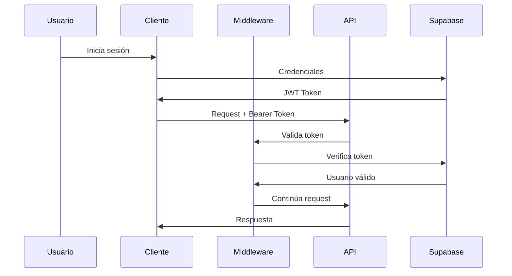
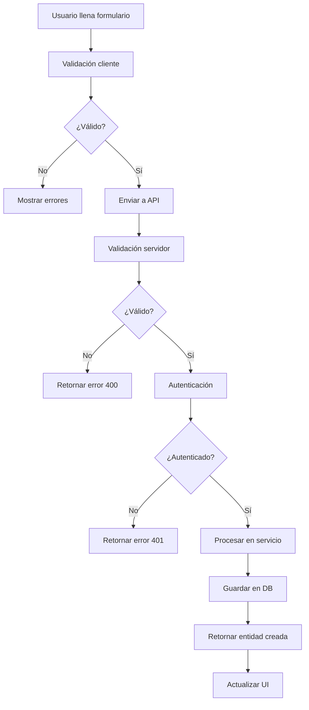
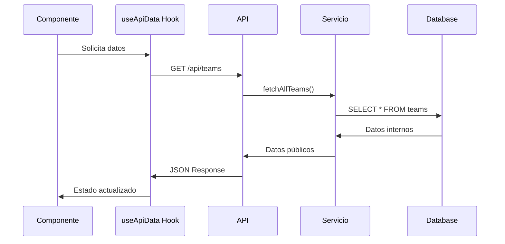

# Major League - Sistema de Gestión de Competiciones Deportivas

Un sistema moderno y seguro para la gestión de competiciones deportivas universitarias, construido con Next.js 15, TypeScript, Supabase y React 19.

## 🚀 Características Principales

- **Gestión de Equipos**: Crear, editar y visualizar equipos con información de capitanes
- **Administración de Partidos**: Programar y gestionar partidos con resultados en tiempo real
- **Control de Competiciones**: Organizar competiciones por año y semestre
- **Autenticación Segura**: Sistema de autenticación completo con Supabase
- **API REST**: API completa con validación Zod y documentación Swagger
- **Interfaz Moderna**: UI responsiva con Tailwind CSS y componentes modulares
z
---

## 📋 Tabla de Contenidos

1. [Arquitectura del Sistema](#-arquitectura-del-sistema)
2. [Decisiones de Diseño](#-decisiones-de-diseño)
3. [Flujos de Trabajo](#-flujos-de-trabajo)
4. [Seguridad y Mejores Prácticas](#-seguridad-y-mejores-prácticas)
5. [Guía para Nuevos Desarrolladores](#-guía-para-nuevos-desarrolladores)
6. [Stack Tecnológico](#-stack-tecnológico)
7. [Configuración y Desarrollo](#-configuración-y-desarrollo)
8. [API y Tipos de Datos](#-api-y-tipos-de-datos)
9. [Testing y Calidad](#-testing-y-calidad)

---

## 🏗️ Arquitectura del Sistema

### Principios Arquitectónicos

#### 1. **Separación de Responsabilidades**
```
┌─────────────────┐    ┌─────────────────┐    ┌─────────────────┐
│   Frontend      │    │   API Layer     │    │   Data Layer    │
│   (React/Next)  │◄──►│   (API Routes)  │◄──►│   (Supabase)    │
└─────────────────┘    └─────────────────┘    └─────────────────┘
│                      │                      │
├─ Components         ├─ Route Handlers     ├─ Database
├─ Hooks              ├─ Middleware         ├─ Auth
├─ Types              ├─ Validation         ├─ RLS Policies
└─ State Management   └─ Error Handling     └─ Storage
```

#### 2. **Flujo de Datos Unidireccional**
```
User Action → Component → Hook → API → Service → Database
                ↓
            UI Update ← State ← Response ← Validation ← Query
```

#### 3. **Capas de Abstracción**
- **Presentación**: Componentes React reutilizables
- **Lógica de Negocio**: Custom hooks y servicios
- **Acceso a Datos**: Servicios de Supabase
- **Persistencia**: Base de datos PostgreSQL

### Estructura de Directorios Explicada

```
majorleague/
├── app/                          # Next.js App Router
│   ├── api/                      # API Routes (Backend)
│   │   ├── helpers/              # Utilidades compartidas
│   │   │   ├── auth.ts           # Autenticación y autorización
│   │   │   └── zodSchemas.ts     # Esquemas de validación
│   │   ├── teams/                # Endpoints de equipos
│   │   ├── matches/              # Endpoints de partidos
│   │   ├── competitions/         # Endpoints de competiciones
│   │   └── docs/                 # Documentación Swagger
│   ├── components/               # Componentes React
│   │   ├── auth/                 # Autenticación UI
│   │   ├── forms/                # Componentes de formularios
│   │   ├── teams/                # UI específica de equipos
│   │   ├── matches/              # UI específica de partidos
│   │   └── competitions/         # UI específica de competiciones
│   ├── hooks/                    # Custom React Hooks
│   │   └── useApiData.ts         # Hook centralizado para API calls
│   ├── private/                  # Páginas protegidas
│   ├── layout.tsx                # Layout principal
│   ├── page.tsx                  # Página de inicio
│   └── globals.css               # Estilos globales
├── lib/                          # Librerías y utilidades
│   └── types.ts                  # Definiciones de tipos TypeScript
├── services/                     # Lógica de negocio
│   ├── team.ts                   # Operaciones de equipos
│   ├── match.ts                  # Operaciones de partidos
│   └── competition.ts            # Operaciones de competiciones
├── utils/                        # Utilidades generales
│   └── supabase/                 # Configuración de Supabase
│       ├── client.ts             # Cliente para browser
│       ├── server.ts             # Cliente para server
│       └── middleware.ts         # Middleware de autenticación
├── middleware.ts                 # Middleware global de Next.js
├── tsconfig.json                 # Configuración TypeScript
├── .eslintrc.json               # Configuración ESLint
└── package.json                  # Dependencias y scripts
```

---

## 🎯 Decisiones de Diseño

### 1. **¿Por qué No Exponer IDs de Base de Datos?**

#### **Problema Identificado:**
```typescript
// ❌ ANTES: Exponía IDs internos
interface TeamFrontend {
  id: number;        // ¡Peligroso! ID interno expuesto
  name: string;
  major: string;
}
```

#### **Solución Implementada:**
```typescript
// ✅ AHORA: Solo datos públicos
interface Team {
  name: string;           // Identificador público
  major: string;
  captain_name?: string;  // Sin IDs internos
}
```

#### **Razones:**
1. **Seguridad**: Previene ataques de enumeración
2. **Escalabilidad**: Permite cambios internos sin afectar la API
3. **Usabilidad**: Los nombres son más intuitivos que números
4. **Compliance**: Mejor para auditorías de seguridad

### 2. **¿Por qué Separar Tipos Internos vs Públicos?**

#### **Arquitectura de Tipos:**
```typescript
// Tipos internos (solo para servicios)
interface TeamDB {
  id: number;              // Para queries de DB
  name: string;
  major: string;
  captain_id?: number;     // Relación interna
}

// Tipos públicos (para API y frontend)
interface Team {
  name: string;            // Identificador público
  major: string;
  captain_name?: string;   // Datos desnormalizados
}

// Tipos de entrada (para validación)
interface CreateTeamInput {
  name: string;
  major: string;
  captain_name?: string;
}
```

#### **Beneficios:**
- **Encapsulación**: La estructura interna puede cambiar
- **Validación**: Diferentes reglas para entrada vs salida
- **Documentación**: Tipos auto-documentados
- **Mantenibilidad**: Cambios internos no rompen la API

### 3. **¿Por qué Custom Hooks en lugar de Fetch Directo?**

#### **Problema:**
```typescript
// ❌ ANTES: Lógica duplicada en cada componente
function TeamList() {
  const [teams, setTeams] = useState([]);
  const [loading, setLoading] = useState(true);
  const [error, setError] = useState(null);
  
  useEffect(() => {
    // Lógica repetida en cada componente...
  }, []);
}
```

#### **Solución:**
```typescript
// ✅ AHORA: Hook reutilizable
function TeamList() {
  const { data: teams, loading, error, refetch } = useApiData<Team[]>({
    endpoint: "/api/teams"
  });
  
  // Lógica de UI simplificada...
}
```

#### **Ventajas:**
- **DRY**: No repetir lógica de fetching
- **Consistencia**: Mismo comportamiento en toda la app
- **Mantenibilidad**: Un lugar para cambios de API
- **Testing**: Más fácil de testear

### 4. **¿Por qué Zod para Validación?**

#### **Comparación de Alternativas:**
```typescript
// Opción 1: Joi (más verboso)
const schema = Joi.object({
  name: Joi.string().required(),
  major: Joi.string().required()
});

// Opción 2: Yup (menos TypeScript-friendly)
const schema = yup.object().shape({
  name: yup.string().required(),
  major: yup.string().required()
});

// ✅ Elegido: Zod (TypeScript-first)
const schema = z.object({
  name: z.string().min(1, "Nombre requerido"),
  major: z.string().min(1, "Carrera requerida")
});

// Inferencia automática de tipos
type Team = z.infer<typeof schema>;
```

#### **Razones para Zod:**
1. **TypeScript-first**: Inferencia automática de tipos
2. **Runtime Safety**: Validación en tiempo de ejecución
3. **Composabilidad**: Esquemas reutilizables
4. **Mensajes de Error**: Personalizables y descriptivos

### 5. **¿Por qué Supabase sobre Otras Alternativas?**

#### **Comparación:**
| Característica | Supabase | Firebase | PlanetScale | Prisma + DB |
|---------------|----------|----------|-------------|-------------|
| TypeScript    | ✅ Nativo | ⚠️ Parcial | ✅ Bueno | ✅ Excelente |
| SQL           | ✅ PostgreSQL | ❌ NoSQL | ✅ MySQL | ✅ Múltiples |
| Auth          | ✅ Integrado | ✅ Integrado | ❌ Manual | ❌ Manual |
| Real-time     | ✅ Nativo | ✅ Nativo | ❌ No | ⚠️ Complejo |
| Costo         | ✅ Gratis tier | ⚠️ Caro | ⚠️ Medio | ⚠️ Variable |

#### **Decisión: Supabase**
- **Desarrollo Rápido**: Auth + DB + Real-time integrados
- **PostgreSQL**: SQL completo con relaciones
- **Row Level Security**: Seguridad a nivel de fila
- **TypeScript**: Generación automática de tipos

## 🔄 Flujos de Trabajo

### 1. **Flujo de Autenticación**



#### **Implementación Detallada:**

1. **Login del Usuario:**
```typescript
// app/login/actions.ts
export async function login(formData: FormData) {
  const supabase = createClient();
  const { error } = await supabase.auth.signInWithPassword({
    email: formData.get('email') as string,
    password: formData.get('password') as string,
  });
  
  if (error) {
    redirect('/error');
  }
  
  redirect('/private');
}
```

2. **Middleware de Validación:**
```typescript
// middleware.ts
export async function middleware(request: NextRequest) {
  if (request.nextUrl.pathname.startsWith('/api/')) {
    // CORS y headers de seguridad
    const response = NextResponse.next();
    response.headers.set('Access-Control-Allow-Origin', '*');
    return response;
  }
  
  // Validación de sesión para rutas protegidas
  return await updateSession(request);
}
```

3. **Validación en API:**
```typescript
// app/api/helpers/auth.ts
export async function getSupabaseAndToken(request: Request) {
  const authHeader = request.headers.get('authorization');
  if (!authHeader?.startsWith('Bearer ')) {
    return { 
      error: NextResponse.json(
        { error: 'Token de autenticación requerido' }, 
        { status: 401 }
      ) 
    };
  }
  
  const token = authHeader.substring(7);
  const supabase = await createAuthenticatedClient(token);
  return { supabase };
}
```

### 2. **Flujo de Creación de Entidades**



#### **Ejemplo: Crear Equipo**

1. **Componente de Formulario:**
```typescript
// app/components/teams/CreateTeamForm.tsx
export default function CreateTeamForm() {
  const [name, setName] = useState("");
  const [major, setMajor] = useState("");
  const [error, setError] = useState("");
  const [success, setSuccess] = useState("");
  const [loading, setLoading] = useState(false);

  const handleSubmit = async (e: React.FormEvent) => {
    e.preventDefault();
    setLoading(true);
    
    try {
      const supabase = createClient();
      const { data: { session } } = await supabase.auth.getSession();
      
      if (!session) {
        setError("Debes iniciar sesión para crear un equipo.");
        return;
      }

      const res = await fetch("/api/teams", {
        method: "POST",
        headers: {
          "Content-Type": "application/json",
          Authorization: `Bearer ${session.access_token}`,
        },
        body: JSON.stringify({ name, major }),
      });

      if (!res.ok) {
        const { error } = await res.json();
        throw new Error(error || "Error al crear el equipo");
      }

      const team: Team = await res.json();
      setSuccess(`¡Equipo "${team.name}" creado exitosamente!`);
      setName("");
      setMajor("");
    } catch (err) {
      setError(err instanceof Error ? err.message : "Error desconocido");
    } finally {
      setLoading(false);
    }
  };
}
```

2. **API Route Handler:**
```typescript
// app/api/teams/route.ts
export async function POST(request: Request) {
  // 1. Autenticación
  const { supabase, error } = await getSupabaseAndToken(request);
  if (error) return error;

  // 2. Validación de entrada
  const body = await request.json();
  const parse = createTeamSchema.safeParse(body);
  if (!parse.success) {
    return NextResponse.json(
      { 
        error: 'Datos inválidos',
        validation_errors: parse.error.errors 
      }, 
      { status: 400 }
    );
  }

  // 3. Lógica de negocio
  try {
    const team = await createTeam(supabase, parse.data);
    return NextResponse.json(team, { status: 201 });
  } catch (error) {
    const message = error instanceof Error ? error.message : 'Error desconocido';
    return NextResponse.json({ error: message }, { status: 400 });
  }
}
```

3. **Servicio de Negocio:**
```typescript
// services/team.ts
export async function createTeam(
  supabase: SupabaseClient, 
  input: CreateTeamInput
): Promise<Team> {
  // 1. Verificar que el nombre no exista
  const { data: existing } = await supabase
    .from('teams')
    .select('name')
    .eq('name', input.name)
    .single();

  if (existing) {
    throw new Error(`Ya existe un equipo con el nombre "${input.name}"`);
  }

  // 2. Resolver capitán si se proporciona
  let captain_id = null;
  if (input.captain_name) {
    captain_id = await getCaptainIdByName(supabase, input.captain_name);
  }

  // 3. Crear el equipo
  const { data, error } = await supabase
    .from('teams')
    .insert({
      name: input.name,
      major: input.major,
      captain_id
    })
    .select()
    .single();

  if (error) {
    throw new Error(`Error al crear equipo: ${error.message}`);
  }

  // 4. Convertir a tipo público
  return dbTeamToPublicTeam(data);
}
```

### 3. **Flujo de Consulta de Datos**



#### **Implementación:**

1. **Hook Personalizado:**
```typescript
// app/hooks/useApiData.ts
export function useApiData<T>({ 
  endpoint, 
  dependencies = [], 
  enabled = true 
}: UseApiDataOptions): UseApiDataReturn<T> {
  const [data, setData] = useState<T | null>(null);
  const [loading, setLoading] = useState(true);
  const [error, setError] = useState<string | null>(null);

  const fetchData = useCallback(async () => {
    if (!enabled) return;

    try {
      setLoading(true);
      setError(null);
      
      const supabase = createClient();
      const { data: session } = await supabase.auth.getSession();
      
      if (!session.session) {
        throw new Error('No hay sesión activa');
      }

      const response = await fetch(endpoint, {
        headers: { 
          Authorization: `Bearer ${session.session.access_token}`,
          'Content-Type': 'application/json',
        },
      });
      
      if (!response.ok) {
        throw new Error(`Error ${response.status}: ${response.statusText}`);
      }
      
      const result = await response.json();
      setData(result);
    } catch (err) {
      const errorMessage = err instanceof Error ? err.message : 'Error desconocido';
      setError(errorMessage);
      console.error(`Error fetching data from ${endpoint}:`, err);
    } finally {
      setLoading(false);
    }
  }, [endpoint, enabled]);

  useEffect(() => {
    fetchData();
  }, [fetchData, dependencies.length]);

  return { data, loading, error, refetch: fetchData };
}
```

2. **Uso en Componentes:**
```typescript
// app/components/teams/TeamList.tsx
export default function TeamList() {
  const { data: teams, loading, error, refetch } = useApiData<Team[]>({
    endpoint: "/api/teams"
  });

  if (loading) {
    return (
      <div className="flex items-center justify-center p-8">
        <div className="animate-spin rounded-full h-8 w-8 border-b-2 border-cyan-400"></div>
        <span className="ml-2 text-gray-300">Cargando equipos...</span>
      </div>
    );
  }

  if (error) {
    return (
      <div className="text-center p-8">
        <p className="text-red-400 mb-4">{error}</p>
        <button 
          onClick={refetch}
          className="bg-blue-500 hover:bg-blue-600 text-white px-4 py-2 rounded transition-colors"
        >
          Reintentar
        </button>
      </div>
    );
  }

  if (!teams || teams.length === 0) {
    return (
      <div className="text-center p-8 text-gray-400">
        <p>No hay equipos registrados</p>
      </div>
    );
  }

  return <TeamGrid teams={teams} />;
}
```

## 🔒 Seguridad y Mejores Prácticas

### 1. **Principios de Seguridad Implementados**

#### **Defense in Depth (Defensa en Profundidad):**
```
┌─────────────────────────────────────────────────────────┐
│                    Frontend                             │
│  ✅ Input Validation   ✅ XSS Prevention               │
└─────────────────────────────────────────────────────────┘
┌─────────────────────────────────────────────────────────┐
│                   Middleware                            │
│  ✅ CORS Headers     ✅ Security Headers               │
└─────────────────────────────────────────────────────────┘
┌─────────────────────────────────────────────────────────┐
│                   API Layer                             │
│  ✅ Authentication   ✅ Authorization   ✅ Validation   │
└─────────────────────────────────────────────────────────┘
┌─────────────────────────────────────────────────────────┐
│                   Database                              │
│  ✅ RLS Policies     ✅ Encrypted Storage               │
└─────────────────────────────────────────────────────────┘
```

#### **Implementación de Headers de Seguridad:**
```typescript
// middleware.ts
export async function middleware(request: NextRequest) {
  if (request.nextUrl.pathname.startsWith('/api/')) {
    const response = NextResponse.next();
    
    // Prevenir ataques XSS
    response.headers.set('X-XSS-Protection', '1; mode=block');
    
    // Prevenir MIME type sniffing
    response.headers.set('X-Content-Type-Options', 'nosniff');
    
    // Prevenir clickjacking
    response.headers.set('X-Frame-Options', 'DENY');
    
    // Controlar referrer information
    response.headers.set('Referrer-Policy', 'strict-origin-when-cross-origin');
    
    return response;
  }
}
```

### 2. **Validación de Entrada Robusta**

#### **Esquemas Zod con Validación Cruzada:**
```typescript
// app/api/helpers/zodSchemas.ts
export const createMatchSchema = z.object({
  local_team_name: nonEmptyString,
  visitor_team_name: nonEmptyString,
  competition_name: nonEmptyString,
  stream_id: z.number().positive().optional(),
  timestamp: timestampString,
  location: urlString,
  local_score: z.number().min(0).optional(),
  visitor_score: z.number().min(0).optional(),
}).refine(
  (data) => data.local_team_name !== data.visitor_team_name,
  {
    message: "El equipo local y visitante deben ser diferentes",
    path: ["visitor_team_name"],
  }
);
```

### 3. **Gestión Segura de Tokens**

#### **Rotación Automática de Tokens:**
```typescript
// utils/supabase/client.ts
export function createClient() {
  return createBrowserClient(supabaseUrl!, supabaseAnonKey!, {
    auth: {
      persistSession: true,
      autoRefreshToken: true,      // ✅ Renovación automática
      detectSessionInUrl: true,
    },
  });
}
```

#### **Validación de Tokens en Servidor:**
```typescript
// app/api/helpers/auth.ts
export async function getSupabaseAndToken(request: Request) {
  const authHeader = request.headers.get('authorization');
  
  if (!authHeader?.startsWith('Bearer ')) {
    return { 
      error: NextResponse.json(
        { error: 'Token de autenticación requerido' }, 
        { status: 401 }
      ) 
    };
  }
  
  const token = authHeader.substring(7);
  
  // ✅ Validación del token con Supabase
  const supabase = await createAuthenticatedClient(token);
  
  // ✅ Verificar que el token sea válido
  const { data: { user }, error } = await supabase.auth.getUser();
  
  if (error || !user) {
    return {
      error: NextResponse.json(
        { error: 'Token inválido o expirado' },
        { status: 401 }
      )
    };
  }
  
  return { supabase, user };
}
```

## 👥 Guía para Nuevos Desarrolladores

### 1. **Onboarding Checklist**

#### **Configuración Inicial:**
- [ ] Clonar el repositorio
- [ ] Instalar Node.js 18+
- [ ] Configurar variables de entorno
- [ ] Ejecutar `npm install`
- [ ] Ejecutar `npm run dev`
- [ ] Acceder a `http://localhost:3000`

#### **Herramientas Recomendadas:**
- [ ] **VS Code** con extensiones:
  - TypeScript Hero
  - ES7+ React/Redux/React-Native snippets
  - Tailwind CSS IntelliSense
  - ESLint
  - Prettier
- [ ] **Postman** o **Insomnia** para testing de API
- [ ] **Supabase CLI** para desarrollo local

### 2. **Convenciones de Código**

#### **Nomenclatura:**
```typescript
// ✅ Componentes: PascalCase
export function TeamCard({ team }: { team: Team }) {}

// ✅ Hooks: camelCase con prefijo 'use'
export function useApiData<T>() {}

// ✅ Servicios: camelCase
export async function createTeam() {}

// ✅ Tipos: PascalCase
interface Team {}
type TeamIdentifier = {};

// ✅ Constantes: UPPER_SNAKE_CASE
const API_BASE_URL = 'http://localhost:3000';

// ✅ Variables: camelCase
const teamName = 'Los Tigres';
```

#### **Estructura de Archivos:**
```typescript
// ✅ Orden de imports
import React from 'react';                    // 1. React
import { NextResponse } from 'next/server';   // 2. Next.js
import { createClient } from '@supabase/ssr'; // 3. Librerías externas
import { Team } from '@/lib/types';           // 4. Tipos internos
import { useApiData } from '@/app/hooks';     // 5. Hooks internos
import { TeamCard } from './TeamCard';        // 6. Componentes relativos

// ✅ Orden de declaraciones en componentes
export default function TeamList() {
  // 1. Hooks de estado
  const [loading, setLoading] = useState(false);
  
  // 2. Hooks personalizados
  const { data: teams } = useApiData<Team[]>({ endpoint: '/api/teams' });
  
  // 3. Funciones de manejo de eventos
  const handleRefresh = useCallback(() => {
    // lógica...
  }, []);
  
  // 4. Effects
  useEffect(() => {
    // lógica...
  }, []);
  
  // 5. Early returns
  if (loading) return <LoadingSpinner />;
  
  // 6. Render principal
  return (
    <div>
      {/* JSX */}
    </div>
  );
}
```

### 3. **Patrones de Desarrollo**

#### **Creación de Nuevos Endpoints:**

1. **Definir Tipos:**
```typescript
// lib/types.ts
export interface NewEntity {
  name: string;
  description: string;
}

export interface CreateNewEntityInput {
  name: string;
  description: string;
}
```

2. **Crear Esquemas de Validación:**
```typescript
// app/api/helpers/zodSchemas.ts
export const createNewEntitySchema = z.object({
  name: nonEmptyString.max(100, "Nombre muy largo"),
  description: z.string().max(500, "Descripción muy larga"),
});
```

3. **Implementar Servicio:**
```typescript
// services/newEntity.ts
export async function createNewEntity(
  supabase: SupabaseClient,
  input: CreateNewEntityInput
): Promise<NewEntity> {
  // Validaciones de negocio
  // Operaciones de base de datos
  // Conversión a tipo público
}
```

4. **Crear API Route:**
```typescript
// app/api/new-entities/route.ts
export async function POST(request: Request) {
  const { supabase, error } = await getSupabaseAndToken(request);
  if (error) return error;

  const body = await request.json();
  const parse = createNewEntitySchema.safeParse(body);
  if (!parse.success) {
    return NextResponse.json(
      { error: 'Datos inválidos', validation_errors: parse.error.errors },
      { status: 400 }
    );
  }

  try {
    const entity = await createNewEntity(supabase, parse.data);
    return NextResponse.json(entity, { status: 201 });
  } catch (error) {
    const message = error instanceof Error ? error.message : 'Error desconocido';
    return NextResponse.json({ error: message }, { status: 400 });
  }
}
```

5. **Crear Componentes UI:**
```typescript
// app/components/new-entities/NewEntityCard.tsx
export function NewEntityCard({ entity }: { entity: NewEntity }) {
  return (
    <div className="bg-gray-800 rounded-2xl shadow-2xl p-8">
      <h2 className="text-2xl font-bold text-blue-200">{entity.name}</h2>
      <p className="text-gray-300">{entity.description}</p>
    </div>
  );
}
```

#### **Testing de Endpoints:**

1. **Obtener Token de Autenticación:**
```bash
# En la consola del navegador (después de login)
const { data } = await supabase.auth.getSession();
console.log(data.session.access_token);
```

2. **Probar con cURL:**
```bash
curl -X POST http://localhost:3000/api/teams \
  -H "Content-Type: application/json" \
  -H "Authorization: Bearer YOUR_TOKEN_HERE" \
  -d '{"name": "Test Team", "major": "Test Major"}'
```

3. **Probar con Swagger UI:**
```bash
# 1. Iniciar la aplicación
npm run dev

# 2. En otra terminal, clonar Swagger UI
git clone https://github.com/swagger-api/swagger-ui.git
cd swagger-ui
npm install
npm run dev

# 3. Abrir http://localhost:3200
# 4. Ingresar: http://localhost:3000/api/docs
# 5. Autorizar con: Bearer YOUR_TOKEN_HERE
```

### 4. **Debugging y Troubleshooting**

#### **Problemas Comunes:**

1. **Error 401 - No Autenticado:**
```typescript
// ✅ Verificar que el token esté presente
const { data: session } = await supabase.auth.getSession();
console.log('Session:', session);

// ✅ Verificar formato del header
headers: {
  'Authorization': `Bearer ${session.access_token}`, // ✅ Correcto
  'Authorization': session.access_token,             // ❌ Incorrecto
}
```

2. **Error 400 - Validación:**
```typescript
// ✅ Verificar esquema Zod
const result = createTeamSchema.safeParse(data);
if (!result.success) {
  console.log('Validation errors:', result.error.errors);
}
```

3. **Error CORS:**
```typescript
// ✅ Verificar middleware
// middleware.ts debe incluir el origen correcto
response.headers.set('Access-Control-Allow-Origin', 'http://localhost:3200');
```

#### **Herramientas de Debug:**

1. **Console Logs Estructurados:**
```typescript
// ✅ Usar console.error para errores
console.error('Error creating team:', error);

// ✅ Usar console.warn para warnings
console.warn('Team name already exists:', teamName);

// ✅ Usar console.log para debug (remover en producción)
console.log('Processing team data:', teamData);
```

2. **Network Tab del Browser:**
- Verificar headers de request/response
- Revisar status codes
- Inspeccionar payloads

3. **Supabase Dashboard:**
- Revisar logs de autenticación
- Verificar políticas RLS
- Inspeccionar queries SQL

## 🛠️ Stack Tecnológico

### Frontend
- **Next.js 15**: React framework con App Router
- **React 19**: Biblioteca de UI con Server Components
- **TypeScript**: Tipado estático
- **Tailwind CSS 4**: Framework de CSS utility-first

### Backend
- **Next.js API Routes**: Endpoints RESTful
- **Supabase**: Backend-as-a-Service (PostgreSQL + Auth)
- **Zod**: Validación de esquemas TypeScript-first

### Herramientas de Desarrollo
- **ESLint**: Linting de código
- **Prettier**: Formateo de código
- **Swagger/OpenAPI**: Documentación de API

## 🔧 Configuración y Desarrollo

### Prerrequisitos
- Node.js 18+
- npm o yarn
- Cuenta de Supabase

### Variables de Entorno
```env
NEXT_PUBLIC_SUPABASE_URL=tu_url_de_supabase
NEXT_PUBLIC_SUPABASE_ANON_KEY=tu_clave_anonima
```

### Instalación
```bash
# Clonar el repositorio
git clone <repository-url>
cd majorleague

# Instalar dependencias
npm install

# Ejecutar en desarrollo
npm run dev

# Construir para producción
npm run build

# Ejecutar linting
npm run lint
```

### Scripts Disponibles
```bash
npm run dev          # Desarrollo con hot reload
npm run build        # Construcción para producción
npm run start        # Servidor de producción
npm run lint         # Verificación de código
npm run lint:fix     # Corrección automática de linting
```

## 📊 API y Tipos de Datos

### Tipos Públicos (API)
```typescript
interface Team {
  name: string;
  major: string;
  captain_name?: string | null;
}

interface Match {
  local_team_name: string;
  visitor_team_name: string;
  competition_name: string;
  stream_id?: number;
  timestamp: string;
  location: string;
  local_score?: number;
  visitor_score?: number;
}

interface Competition {
  name: string;
  year: number;
  semester: number;
  start_date: string;
  end_date: string;
}
```

### Tipos Internos (Base de Datos)
Los tipos `TeamDB`, `MatchDB`, y `CompetitionDB` incluyen IDs internos y se usan solo en servicios.

### API Endpoints

#### Equipos
- `GET /api/teams` - Listar todos los equipos
- `POST /api/teams` - Crear nuevo equipo
- `PUT /api/teams` - Actualizar equipo
- `DELETE /api/teams` - Eliminar equipo
- `GET /api/teams/name/[name]` - Obtener equipo por nombre

#### Partidos
- `GET /api/matches` - Listar todos los partidos
- `POST /api/matches` - Crear nuevo partido
- `PUT /api/matches` - Actualizar partido
- `DELETE /api/matches` - Eliminar partido
- `GET /api/matches/local/[local]/visitor/[visitor]` - Obtener partido específico
- `GET /api/matches/year/[year]` - Partidos por año
- `GET /api/matches/month/[month]` - Partidos por mes

#### Competiciones
- `GET /api/competitions` - Listar todas las competiciones
- `POST /api/competitions` - Crear nueva competición
- `PUT /api/competitions` - Actualizar competición
- `DELETE /api/competitions` - Eliminar competición
- `GET /api/competitions/name/[name]` - Obtener competición por nombre

### Documentación Swagger
La documentación completa de la API está disponible en `/api/docs` cuando el servidor está ejecutándose.

#### Configuración de Swagger UI:
1. Iniciar la aplicación: `npm run dev`
2. Clonar Swagger UI en directorio separado:
   ```bash
   git clone https://github.com/swagger-api/swagger-ui.git
   cd swagger-ui
   npm install
   npm run dev
   ```
3. Abrir `http://localhost:3200`
4. Ingresar URL: `http://localhost:3000/api/docs`
5. Autorizar con token: `Bearer YOUR_TOKEN_HERE`

#### 🔧 Troubleshooting Swagger UI

##### Problema: "No autenticado" en algunos endpoints

**Síntomas:**
- Algunos endpoints (como `/api/matches/month/{month}`) funcionan
- Otros endpoints (como `/api/matches/year/{year}`) devuelven 401 Unauthorized
- Ambos endpoints tienen la misma implementación de autenticación

**Causa Raíz:**
El problema suele estar en la configuración de CORS del middleware, que no permite todos los orígenes necesarios para Swagger UI.

**Solución Implementada:**
```typescript
// middleware.ts - Configuración mejorada de CORS
const allowedOrigins = process.env.NODE_ENV === 'production' 
  ? ['https://your-production-domain.com'] 
  : [
      'http://localhost:3000',  // Next.js dev server
      'http://localhost:3200',  // Swagger UI
      'http://127.0.0.1:3000',  // Alternative localhost
      'http://127.0.0.1:3200'   // Alternative localhost for Swagger
    ];

const origin = request.headers.get('origin');
if (origin && allowedOrigins.includes(origin)) {
  response.headers.set('Access-Control-Allow-Origin', origin);
} else if (process.env.NODE_ENV !== 'production') {
  // En desarrollo, permitir cualquier origen localhost
  response.headers.set('Access-Control-Allow-Origin', '*');
}
```

**Pasos para Verificar:**

1. **Verificar Headers de CORS:**
```bash
# Probar endpoint que funciona
curl -H "Origin: http://localhost:3200" \
     -H "Authorization: Bearer YOUR_TOKEN" \
     -v http://localhost:3000/api/matches/month/1

# Probar endpoint que falla
curl -H "Origin: http://localhost:3200" \
     -H "Authorization: Bearer YOUR_TOKEN" \
     -v http://localhost:3000/api/matches/year/2024
```

2. **Verificar Token en Browser:**
```javascript
// En la consola del navegador (después de login)
const { data } = await supabase.auth.getSession();
console.log('Token:', data.session?.access_token);
```

3. **Verificar Network Tab:**
- Abrir DevTools → Network
- Hacer request desde Swagger UI
- Verificar headers de request y response
- Buscar errores de CORS en la consola

**Configuración Correcta de Swagger UI:**

1. **Obtener Token:**
```bash
# Método 1: Desde la aplicación web
# 1. Ir a http://localhost:3000/login
# 2. Iniciar sesión
# 3. Abrir DevTools → Console
# 4. Ejecutar: supabase.auth.getSession()

# Método 2: Desde API directa
curl -X POST http://localhost:3000/auth/login \
  -H "Content-Type: application/json" \
  -d '{"email": "tu@email.com", "password": "tu_password"}'
```

2. **Configurar Autorización en Swagger:**
```
1. Abrir Swagger UI en http://localhost:3200
2. Ingresar URL: http://localhost:3000/api/docs
3. Hacer clic en "Authorize" 🔒
4. En el campo "Value", ingresar: Bearer eyJhbGciOiJIUzI1NiIsInR5cCI6IkpXVCJ9...
5. Hacer clic en "Authorize"
6. Hacer clic en "Close"
```

3. **Probar Endpoints:**
```
✅ Correcto: Status 200, datos devueltos
❌ Error 401: Verificar token y headers CORS
❌ Error 400: Verificar parámetros de entrada
❌ Error 404: Verificar URL del endpoint
```

**Debugging Avanzado:**

1. **Logs del Servidor:**
```bash
# Terminal donde corre npm run dev
# Buscar logs como:
# "Token de autenticación requerido"
# "Token inválido o expirado"
# "CORS error"
```

2. **Verificar Middleware:**
```typescript
// Agregar logs temporales en middleware.ts
console.log('Request origin:', request.headers.get('origin'));
console.log('Request method:', request.method);
console.log('Request path:', request.nextUrl.pathname);
```

3. **Verificar API Route:**
```typescript
// Agregar logs temporales en route handlers
console.log('Auth header:', request.headers.get('authorization'));
console.log('Request body:', await request.json());
```

#### 📝 Checklist de Verificación para Swagger UI

- [ ] ✅ Aplicación corriendo en `http://localhost:3000`
- [ ] ✅ Swagger UI corriendo en `http://localhost:3200`
- [ ] ✅ URL de documentación: `http://localhost:3000/api/docs`
- [ ] ✅ Token obtenido después de login exitoso
- [ ] ✅ Token configurado en Swagger con prefijo "Bearer "
- [ ] ✅ Headers CORS configurados en middleware
- [ ] ✅ Endpoints responden con status 200
- [ ] ✅ No hay errores en la consola del navegador

#### 🚨 Errores Comunes y Soluciones

| Error | Causa | Solución |
|-------|-------|----------|
| 401 Unauthorized | Token faltante o inválido | Verificar autorización en Swagger |
| CORS Error | Origen no permitido | Verificar middleware CORS |
| 400 Bad Request | Parámetros inválidos | Verificar esquema de entrada |
| 404 Not Found | URL incorrecta | Verificar ruta del endpoint |
| Network Error | Servidor no disponible | Verificar que `npm run dev` esté corriendo |

---

**Desarrollado con ❤️ para la gestión eficiente de competiciones deportivas universitarias.**

*Última actualización: Diciembre 2024*
